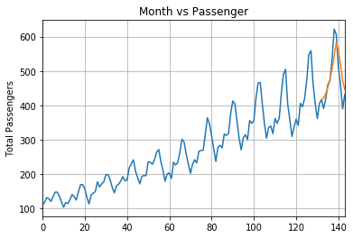

# Predict Number of Passengers

## About

This is an LSTM excersice.<br>
The dataset is taken out from the seaborn library and consists of number flight passanger per month in a span of 12 years. This excersice creates a LSTM model and trains it on the first 132 months, leaving the remaining 12 for comparison agains the model's predictions.

For details on the implementation of the training and data processing take a look at the notebook.

## Prerequisites

The notebook can run in CPU (no GPU is required).
I use anaconda and therefore I use conda to create my virtual environments. The following packages are needed to run the notebook

```
pytorch
seaborn
pandas
matplotlib
sklearn
jupyter
```

## Predictions

This is a graph showing a comparison between the predictions of the number of passengers on the last 12 months (the yellow line) and the actual number of passengers there were on those 12 months (the ground truth).<br>

<p align="center">
 </a>
</p>